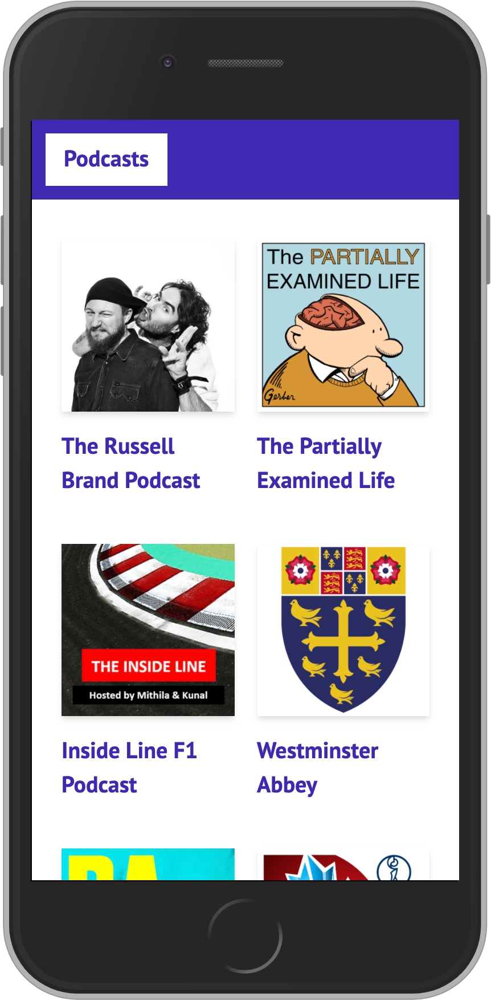
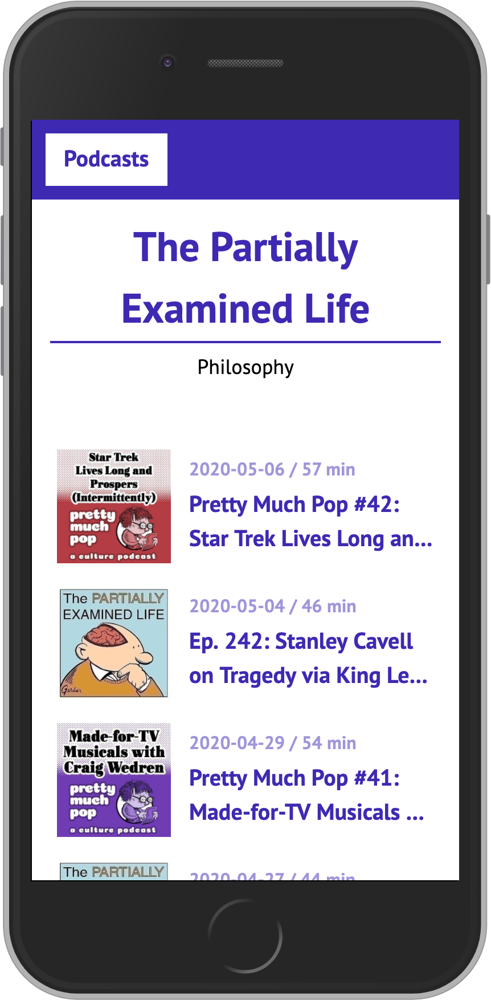
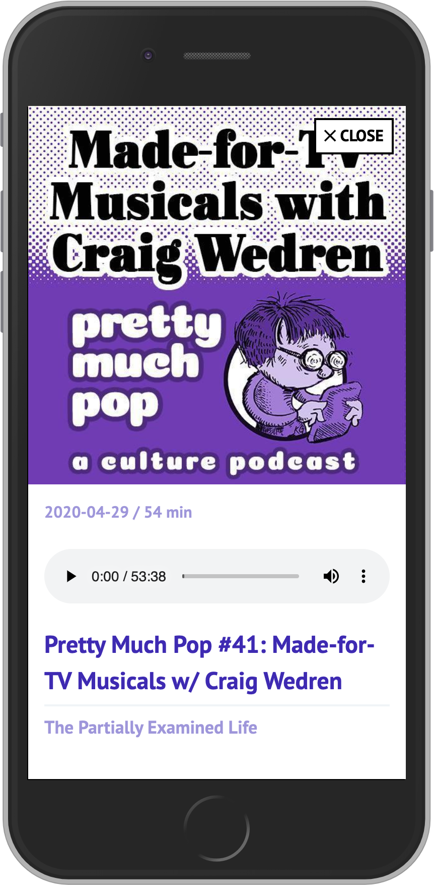

# App de Podcasts con Next.js & Tailwind CSS

Esta app está basada en el [curso de Next.js de Platzi](https://platzi.com/clases/next-js/) impartido por [Roberto González](https://aerolab.co/handbook-gente), CTO de [Aerolab](https://aerolab.co/handbook-gente).

En ella hacemos uso de la [API de AudioBoom](https://github.com/audioBoom/api)

Para los estilos usé de base [TailwindCSS](https://tailwindcss.com/)

Los estilos visuales están basados en un diseño de [Dribbble](https://dribbble.com/shots/3744179-Music-Podcast-Mobile-p-1)

## Pasos para iniciar el proyecto

1. `npm install` instala las dependencias
2. `npm run dev` ejecuta el entorno de desarrollo
3. `npm run export` ejecuta el entorno de producción

## Licencia

MIT

